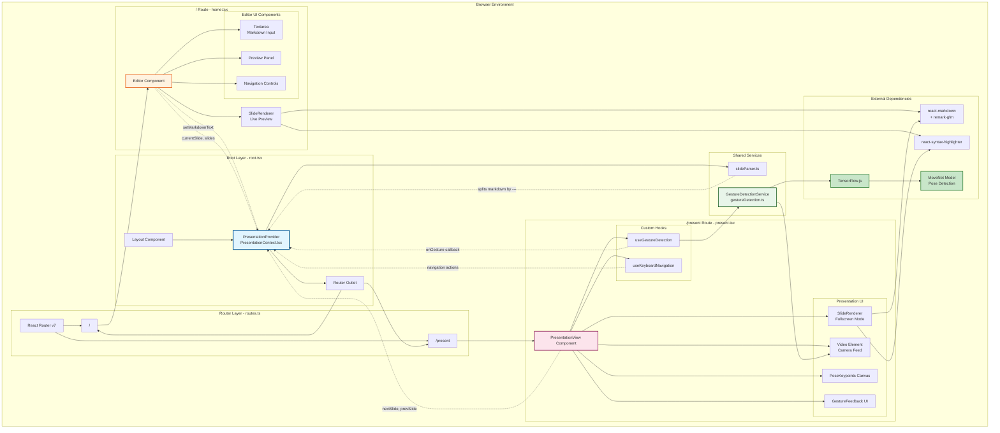
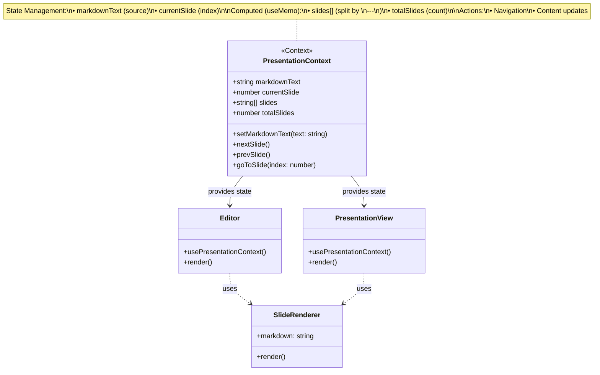
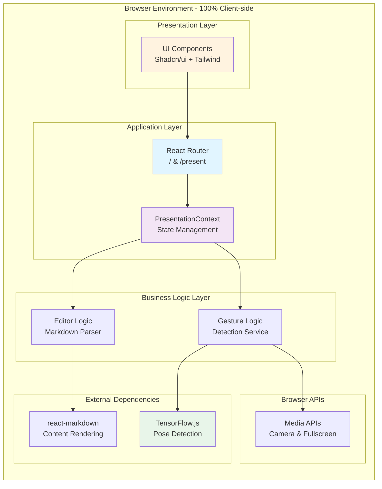
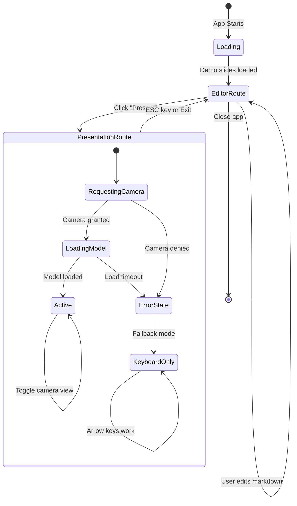
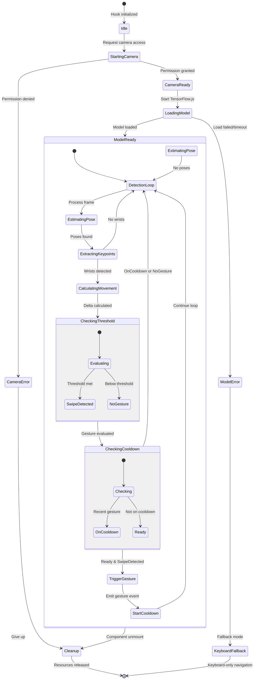
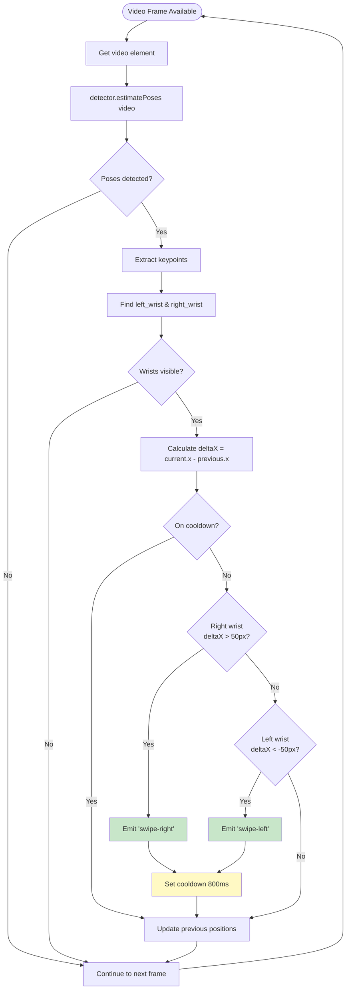
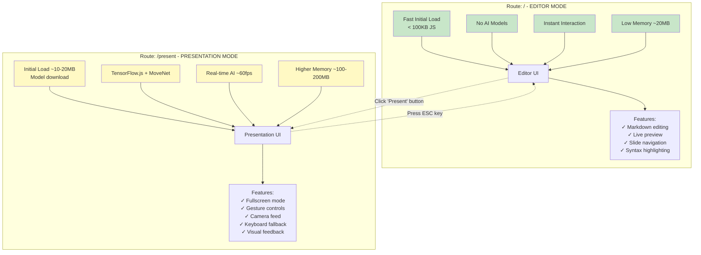
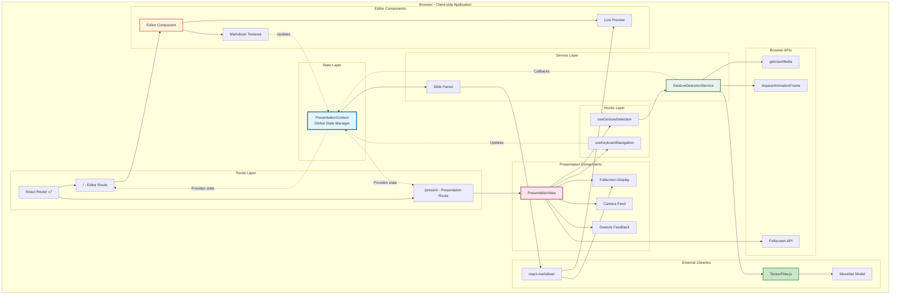

# AirDeck Architecture

## System Overview

AirDeck is a client-side Single Page Application (SPA) built with React Router v7, featuring a clear separation between the lightweight editor experience and the AI-powered presentation mode.

```
┌─────────────────────────────────────────────────────────────────────┐
│                           Browser Environment                        │
│                         (100% Client-side)                           │
└─────────────────────────────────────────────────────────────────────┘
```

## High-Level Architecture Diagram

### ASCII Diagram

```
                    ┌────────────────────────────┐
                    │       React Router         │
                    │      (Route Manager)       │
                    └────────┬──────────┬────────┘
                             │          │
                    ┌────────▼──┐   ┌───▼────────┐
                    │  / (home) │   │  /present  │
                    │   Route   │   │   Route    │
                    └────┬──────┘   └──────┬─────┘
                         │                 │
                         │                 │
              ┌──────────▼──────────┐      │
              │                     │      │
              │  ┌───────────────┐  │      │
              │  │ PresentationProvider  (Global State)
              │  │   (Context)    │  │      │
              │  └───────┬────────┘  │      │
              │          │            │      │
              │  Provides:            │      │
              │  • markdownText       │      │
              │  • slides[]           │      │
              │  • currentSlide       │      │
              │  • nextSlide()        │      │
              │  • prevSlide()        │      │
              │                       │      │
              └───────────────────────┘      │
                         │                   │
        ┌────────────────┼───────────────────┼────────────┐
        │                │                   │            │
        │     ┌──────────▼──────────┐  ┌─────▼──────────┐│
        │     │   <Editor />        │  │ <Presentation  ││
        │     │   Component         │  │    View />     ││
        │     └──────────┬──────────┘  └────────┬───────┘│
        │                │                      │        │
        │     Renders:   │           Renders:   │        │
        │     • Markdown │           • Fullscreen│        │
        │       Textarea │           • SlideRenderer│    │
        │     • Live     │           • Gesture UI│       │
        │       Preview  │           • Camera   │        │
        │     • Navigation│                     │        │
        │                │                      │        │
        └────────────────┼──────────────────────┼────────┘
                         │                      │
                         │                      │
                  Uses:  │               Uses:  │
                         │                      │
          ┌──────────────▼──────┐      ┌────────▼──────────────┐
          │  <SlideRenderer />  │      │  useGestureDetection  │
          │                     │      │       (Hook)          │
          │  • react-markdown   │      └───────────┬───────────┘
          │  • remark-gfm       │                  │
          │  • Tailwind styles  │                  │
          └─────────────────────┘                  │
                                         ┌─────────▼───────────┐
                                         │ GestureDetection    │
                                         │    Service          │
                                         │                     │
                                         │  • TensorFlow.js    │
                                         │  • MoveNet Model    │
                                         │  • Pose Detection   │
                                         │  • Swipe Logic      │
                                         └─────────────────────┘
```

### Mermaid Diagram



## Component Architecture

### 1. Application Root Layer

```
┌──────────────────────────────────────────────────────────────┐
│                         root.tsx                              │
│  ┌────────────────────────────────────────────────────────┐  │
│  │              Layout Component                           │  │
│  │  • HTML shell                                           │  │
│  │  • Meta tags, Links, Scripts                            │  │
│  │  • Font loading (Inter)                                 │  │
│  └────────────────────────────────────────────────────────┘  │
│  ┌────────────────────────────────────────────────────────┐  │
│  │          PresentationProvider                           │  │
│  │  • Wraps entire app                                     │  │
│  │  • Loads demo slides from server                        │  │
│  │  • Provides global state to all routes                  │  │
│  └────────────────────────────────────────────────────────┘  │
│                            │                                  │
│                    <Outlet /> (React Router)                 │
│                            │                                  │
│              ┌─────────────┴─────────────┐                   │
│              ▼                           ▼                    │
│        home.tsx                    present.tsx                │
└──────────────────────────────────────────────────────────────┘
```

### 2. State Management Architecture

#### ASCII Diagram

```
┌─────────────────────────────────────────────────────────────┐
│            PresentationContext (Global State)                │
├─────────────────────────────────────────────────────────────┤
│                                                               │
│  State:                                                       │
│  ┌────────────────────────────────────────────────────────┐ │
│  │ markdownText: string                                    │ │
│  │   • Full Markdown content from editor                   │ │
│  └────────────────────────────────────────────────────────┘ │
│  ┌────────────────────────────────────────────────────────┐ │
│  │ currentSlide: number                                    │ │
│  │   • Index of currently displayed slide (0-based)        │ │
│  └────────────────────────────────────────────────────────┘ │
│                                                               │
│  Computed (useMemo):                                          │
│  ┌────────────────────────────────────────────────────────┐ │
│  │ slides: string[]                                        │ │
│  │   • Split by "\n---\n"                                  │ │
│  │   • Trimmed & filtered for empty slides                 │ │
│  │   • Auto-updates when markdownText changes              │ │
│  └────────────────────────────────────────────────────────┘ │
│  ┌────────────────────────────────────────────────────────┐ │
│  │ totalSlides: number                                     │ │
│  │   • slides.length                                       │ │
│  └────────────────────────────────────────────────────────┘ │
│                                                               │
│  Actions:                                                     │
│  ┌────────────────────────────────────────────────────────┐ │
│  │ setMarkdownText(text: string)                          │ │
│  │   • Updates editor content                              │ │
│  │   • Triggers slides recomputation                       │ │
│  └────────────────────────────────────────────────────────┘ │
│  ┌────────────────────────────────────────────────────────┐ │
│  │ nextSlide()                                             │ │
│  │   • Increment currentSlide (max: totalSlides - 1)       │ │
│  └────────────────────────────────────────────────────────┘ │
│  ┌────────────────────────────────────────────────────────┐ │
│  │ prevSlide()                                             │ │
│  │   • Decrement currentSlide (min: 0)                     │ │
│  └────────────────────────────────────────────────────────┘ │
│  ┌────────────────────────────────────────────────────────┐ │
│  │ goToSlide(index: number)                               │ │
│  │   • Jump to specific slide                              │ │
│  └────────────────────────────────────────────────────────┘ │
│                                                               │
└─────────────────────────────────────────────────────────────┘
```

#### Mermaid Diagram



### 3. Editor Route Architecture (`/`)

```
┌─────────────────────────────────────────────────────────────┐
│                      <Editor /> Component                     │
├─────────────────────────────────────────────────────────────┤
│                                                               │
│  ┌──────────────────────────────────────────────────────┐   │
│  │                    Header                             │   │
│  │  • App title "AirDeck"                                │   │
│  │  • Slide count display                                │   │
│  │  • "Present" button → navigate('/present')            │   │
│  └──────────────────────────────────────────────────────┘   │
│                                                               │
│  ┌──────────────────────────────────────────────────────┐   │
│  │         ResizablePanelGroup (Horizontal)              │   │
│  │                                                        │   │
│  │  ┌─────────────────────┬──────────────────────────┐  │   │
│  │  │   Editor Panel      │    Preview Panel         │  │   │
│  │  │   (50% default)     │    (50% default)         │  │   │
│  │  ├─────────────────────┼──────────────────────────┤  │   │
│  │  │                     │                          │  │   │
│  │  │  ┌───────────────┐  │  ┌────────────────────┐  │  │   │
│  │  │  │  <Textarea>   │  │  │ <SlideRenderer>    │  │  │   │
│  │  │  │               │  │  │                    │  │  │   │
│  │  │  │  Markdown     │  │  │  Renders current   │  │  │   │
│  │  │  │  input        │  │  │  slide with        │  │  │   │
│  │  │  │               │  │  │  react-markdown    │  │  │   │
│  │  │  │  onChange →   │  │  │                    │  │  │   │
│  │  │  │  setMarkdown  │  │  │  slides[current]   │  │  │   │
│  │  │  │  Text()       │  │  │                    │  │  │   │
│  │  │  └───────────────┘  │  └────────────────────┘  │  │   │
│  │  │                     │                          │  │   │
│  │  └─────────────────────┴──────────────────────────┘  │   │
│  │                                                        │   │
│  │                  ┌──────────────────────┐             │   │
│  │                  │   Navigation Bar     │             │   │
│  │                  │  • Prev/Next buttons │             │   │
│  │                  │  • Slide indicators  │             │   │
│  │                  │    (clickable dots)  │             │   │
│  │                  └──────────────────────┘             │   │
│  └──────────────────────────────────────────────────────┘   │
│                                                               │
│  Dependencies:                                                │
│  • usePresentationContext() - Get/set state                  │
│  • useNavigate() - Route navigation                          │
│  • Shadcn UI components (Button, Textarea, Resizable)        │
│                                                               │
│  Note: NO AI models loaded on this route                     │
│        Optimized for fast editor performance                 │
└─────────────────────────────────────────────────────────────┘
```

### 4. Presentation Route Architecture (`/present`)

```
┌─────────────────────────────────────────────────────────────┐
│              <PresentationView /> Component                   │
├─────────────────────────────────────────────────────────────┤
│                                                               │
│  Fullscreen Mode                                              │
│  ┌────────────────────────────────────────────────────────┐ │
│  │ requestFullscreen() on mount                            │ │
│  │ exitFullscreen() on unmount or ESC key                  │ │
│  └────────────────────────────────────────────────────────┘ │
│                                                               │
│  ┌────────────────────────────────────────────────────────┐ │
│  │              Camera Feed (Toggle with 'C')              │ │
│  │  Position: top-right corner (when visible)              │ │
│  │  ┌──────────────────────────────────────────────────┐  │ │
│  │  │ <video> element (320x240px)                      │  │ │
│  │  │  • Mirror transform (scaleX(-1))                 │  │ │
│  │  │  • Border & shadow when visible                  │  │ │
│  │  └──────────────────────────────────────────────────┘  │ │
│  │  ┌──────────────────────────────────────────────────┐  │ │
│  │  │ <PoseKeypoints> overlay                          │  │ │
│  │  │  • Draws skeleton on canvas                      │  │ │
│  │  │  • Shows detected pose keypoints                 │  │ │
│  │  └──────────────────────────────────────────────────┘  │ │
│  └────────────────────────────────────────────────────────┘ │
│                                                               │
│  ┌────────────────────────────────────────────────────────┐ │
│  │              Main Slide Display (Center)                │ │
│  │  ┌──────────────────────────────────────────────────┐  │ │
│  │  │ <SlideRenderer>                                  │  │ │
│  │  │   • Full screen                                  │  │ │
│  │  │   • Shows slides[currentSlide]                   │  │ │
│  │  └──────────────────────────────────────────────────┘  │ │
│  └────────────────────────────────────────────────────────┘ │
│                                                               │
│  ┌────────────────────────────────────────────────────────┐ │
│  │              UI Overlays (Fixed Position)               │ │
│  │                                                          │ │
│  │  Top-left:                                               │ │
│  │  • Camera toggle button                                  │ │
│  │  • Fullscreen button / ESC hint                          │ │
│  │                                                          │ │
│  │  Top-center (when error):                                │ │
│  │  • <Alert> for camera/model errors                       │ │
│  │                                                          │ │
│  │  Bottom-center:                                          │ │
│  │  • Slide progress indicators (dots)                      │ │
│  │                                                          │ │
│  │  Bottom-right:                                           │ │
│  │  • Slide counter (e.g., "3 / 10")                        │ │
│  │                                                          │ │
│  │  <GestureFeedback /> (animated overlays):                │ │
│  │  • "AI Active" indicator                                 │ │
│  │  • Swipe direction feedback                              │ │
│  └────────────────────────────────────────────────────────┘ │
│                                                               │
│  ┌────────────────────────────────────────────────────────┐ │
│  │                 Hooks Used                              │ │
│  │                                                          │ │
│  │  useGestureDetection():                                  │ │
│  │    Returns: { isLoading, error, isActive,                │ │
│  │              lastGesture, videoRef, keypoints }          │ │
│  │    Callbacks: onGesture(gesture) → next/prevSlide()      │ │
│  │                                                          │ │
│  │  useKeyboardNavigation():                                │ │
│  │    • Arrow keys → next/prevSlide()                       │ │
│  │    • ESC → exit fullscreen & navigate('/')               │ │
│  │    • C → toggle camera visibility                        │ │
│  │                                                          │ │
│  │  usePresentationContext():                               │ │
│  │    • Access slides, currentSlide                         │ │
│  │    • Call nextSlide(), prevSlide()                       │ │
│  └────────────────────────────────────────────────────────┘ │
│                                                               │
│  Loading States:                                              │
│  ┌────────────────────────────────────────────────────────┐ │
│  │ isLoading → Show spinner & "Loading AI..." message     │ │
│  │ error → Show Alert with error message                  │ │
│  │ totalSlides === 0 → Show "No slides" message           │ │
│  └────────────────────────────────────────────────────────┘ │
└─────────────────────────────────────────────────────────────┘
```

### 5. Gesture Detection System

```
┌─────────────────────────────────────────────────────────────┐
│           useGestureDetection Hook (Entry Point)              │
├─────────────────────────────────────────────────────────────┤
│                                                               │
│  Initialization Flow:                                         │
│  ┌────────────────────────────────────────────────────────┐ │
│  │ 1. Request Camera Access                                │ │
│  │    • navigator.mediaDevices.getUserMedia()              │ │
│  │    • 640x480 resolution, user-facing camera             │ │
│  │    • Stream → videoRef.current.srcObject                │ │
│  └────────────────────────────────────────────────────────┘ │
│  ┌────────────────────────────────────────────────────────┐ │
│  │ 2. Initialize GestureDetectionService                   │ │
│  │    • Creates new service instance                       │ │
│  │    • Calls initializeWithTimeout(30000ms)               │ │
│  └────────────────────────────────────────────────────────┘ │
│  ┌────────────────────────────────────────────────────────┐ │
│  │ 3. Start Detection Loop                                 │ │
│  │    • requestAnimationFrame loop                         │ │
│  │    • Calls service.detectGesture(videoElement)          │ │
│  │    • Updates keypoints for visualization                │ │
│  │    • Triggers onGesture callback                        │ │
│  └────────────────────────────────────────────────────────┘ │
│                                                               │
│  Cleanup on Unmount:                                          │
│  • Cancel animation frame                                    │
│  • Stop camera stream tracks                                 │
│  • Dispose service (cleanup TensorFlow resources)            │
│                                                               │
└───────────────────────┬─────────────────────────────────────┘
                        │
                        │ Uses
                        ▼
┌─────────────────────────────────────────────────────────────┐
│           GestureDetectionService (Core Logic)                │
├─────────────────────────────────────────────────────────────┤
│                                                               │
│  Configuration (DEFAULT_CONFIG):                              │
│  ┌────────────────────────────────────────────────────────┐ │
│  │ swipeThreshold: 50px    (minimum movement to detect)    │ │
│  │ cooldownMs: 800ms       (prevent duplicate triggers)    │ │
│  │ minConfidence: 0.3      (keypoint visibility threshold) │ │
│  └────────────────────────────────────────────────────────┘ │
│                                                               │
│  Model Loading (initialize()):                                │
│  ┌────────────────────────────────────────────────────────┐ │
│  │ 1. await tf.ready()                                     │ │
│  │    • Initialize TensorFlow.js backend                   │ │
│  └────────────────────────────────────────────────────────┘ │
│  ┌────────────────────────────────────────────────────────┐ │
│  │ 2. poseDetection.createDetector()                       │ │
│  │    • Model: MoveNet                                     │ │
│  │    • Type: SINGLEPOSE_LIGHTNING                         │ │
│  │    • Fast inference (~10-20ms per frame)                │ │
│  └────────────────────────────────────────────────────────┘ │
│                                                               │
│  Gesture Detection Logic (detectGesture()):                   │
│  ┌────────────────────────────────────────────────────────┐ │
│  │ Input: HTMLVideoElement                                 │ │
│  │ Output: GestureType ('swipe-right' | 'swipe-left' | null)│ │
│  └────────────────────────────────────────────────────────┘ │
│                                                               │
│  ┌────────────────────────────────────────────────────────┐ │
│  │ Step 1: Estimate Poses                                  │ │
│  │   const poses = await detector.estimatePoses(video)     │ │
│  │   • Returns array of detected people                    │ │
│  │   • We use poses[0] (single person mode)                │ │
│  └────────────────────────────────────────────────────────┘ │
│  ┌────────────────────────────────────────────────────────┐ │
│  │ Step 2: Extract Wrist Keypoints                         │ │
│  │   • leftWrist = keypoints.find(kp => kp.name ===        │ │
│  │                                    'left_wrist')         │ │
│  │   • rightWrist = keypoints.find(kp => kp.name ===       │ │
│  │                                     'right_wrist')       │ │
│  │   • Each has: { x, y, score, name }                     │ │
│  └────────────────────────────────────────────────────────┘ │
│  ┌────────────────────────────────────────────────────────┐ │
│  │ Step 3: Calculate Movement (Delta X)                    │ │
│  │   deltaX = currentWrist.x - prevWristPositions[wrist]   │ │
│  │   • Positive = moving right                             │ │
│  │   • Negative = moving left                              │ │
│  └────────────────────────────────────────────────────────┘ │
│  ┌────────────────────────────────────────────────────────┐ │
│  │ Step 4: Detect Swipe Right                              │ │
│  │   IF rightWrist.score > minConfidence                   │ │
│  │   AND deltaX > swipeThreshold (50px)                    │ │
│  │   AND !isOnCooldown                                     │ │
│  │   THEN:                                                 │ │
│  │     • Update prevWristPositions.right                   │ │
│  │     • startCooldown()                                   │ │
│  │     • return 'swipe-right'                              │ │
│  └────────────────────────────────────────────────────────┘ │
│  ┌────────────────────────────────────────────────────────┐ │
│  │ Step 5: Detect Swipe Left                               │ │
│  │   IF leftWrist.score > minConfidence                    │ │
│  │   AND deltaX < -swipeThreshold (-50px)                  │ │
│  │   AND !isOnCooldown                                     │ │
│  │   THEN:                                                 │ │
│  │     • Update prevWristPositions.left                    │ │
│  │     • startCooldown()                                   │ │
│  │     • return 'swipe-left'                               │ │
│  └────────────────────────────────────────────────────────┘ │
│                                                               │
│  State Management:                                            │
│  • prevWristPositions: { left, right } - Track movement      │
│  • isOnCooldown: boolean - Prevent rapid triggers            │
│  • lastKeypoints: Keypoint[] - For visualization             │
│                                                               │
│  Cooldown Mechanism:                                          │
│  ┌────────────────────────────────────────────────────────┐ │
│  │ startCooldown() {                                       │ │
│  │   isOnCooldown = true                                   │ │
│  │   setTimeout(() => isOnCooldown = false, 800ms)         │ │
│  │ }                                                        │ │
│  │ • Prevents one long swipe from triggering multiple times│ │
│  └────────────────────────────────────────────────────────┘ │
│                                                               │
└─────────────────────────────────────────────────────────────┘
```

## Data Flow Diagrams

### 1. Editor Flow (Content Creation)

#### ASCII Diagram

```
┌─────────────┐
│    User     │
│  Types in   │
│  Textarea   │
└──────┬──────┘
       │
       │ onChange event
       │
       ▼
┌──────────────────────────────┐
│ Editor.setMarkdownText()     │
└──────────┬───────────────────┘
           │
           │ Context update
           │
           ▼
┌───────────────────────────────┐
│  PresentationContext          │
│  • Updates markdownText       │
│  • Recomputes slides[]        │
│    (useMemo splits by \n---\n)│
└───────────┬───────────────────┘
            │
            │ Re-render triggered
            │
    ┌───────┴────────┐
    │                │
    ▼                ▼
┌─────────┐    ┌──────────────┐
│ Editor  │    │ Preview      │
│ Updates │    │ SlideRenderer│
│ Counter │    │ Re-renders   │
└─────────┘    └──────────────┘
### 2. Presentation Flow (Gesture Navigation)

#### ASCII Diagram

```

┌──────────────┐
│ Webcam │
│ Video Feed │
└──────┬───────┘
│ 60fps
│
▼
┌────────────────────────────────┐
│ requestAnimationFrame Loop │
│ (useGestureDetection) │
└──────┬─────────────────────────┘
│
│ video element
│
▼
┌────────────────────────────────┐
│ GestureDetectionService │
│ .detectGesture(videoElement) │
│ │
│ • estimatePoses() │
│ • Extract wrist keypoints │
│ • Calculate deltaX │
│ • Check threshold & cooldown │
└──────┬─────────────────────────┘
│
│ Returns: GestureType
│ ('swipe-right' | 'swipe-left' | null)
│
▼
┌────────────────────────────────┐
│ onGesture Callback │
│ (PresentationView) │
│ │
│ if (gesture === 'swipe-right') │
│ → nextSlide() │
│ if (gesture === 'swipe-left') │
│ → prevSlide() │
└──────┬─────────────────────────┘
│
│ Context action
│
▼
┌────────────────────────────────┐
│ PresentationContext │
│ • Updates currentSlide │
│ (increment or decrement) │
└──────┬─────────────────────────┘
│
│ Re-render
│
▼
┌────────────────────────────────┐
│ PresentationView │
│ • SlideRenderer updates │
│ (shows slides[currentSlide]) │
│ • GestureFeedback animates │
│ • Slide indicators update │
└────────────────────────────────┘

````

#### Mermaid Diagram

```mermaid
sequenceDiagram
    participant Webcam
    participant Loop as RAF Loop<br/>(useGestureDetection)
    participant Service as GestureDetectionService
    participant Callback as onGesture Callback
    participant Context as PresentationContext
    participant View as PresentationView

    Webcam->>Loop: Video feed (60fps)

    loop Every frame
        Loop->>Service: detectGesture(videoElement)

        Note over Service: • estimatePoses()<br/>• Extract wrist keypoints<br/>• Calculate deltaX<br/>• Check threshold & cooldown

        Service-->>Callback: Returns GestureType<br/>('swipe-right' | 'swipe-left' | null)

        alt Swipe Right Detected
            Callback->>Context: nextSlide()
        else Swipe Left Detected
            Callback->>Context: prevSlide()
### 3. Keyboard Fallback Flow

#### ASCII Diagram

````

┌──────────────┐
│ User │
│ Presses Key │
└──────┬───────┘
│
│ keydown event
│
▼
┌────────────────────────────────┐
│ useKeyboardNavigation Hook │
│ (PresentationView) │
│ │
│ switch (event.key) { │
│ case 'ArrowRight': │
│ → onNext() │
│ case 'ArrowLeft': │
│ → onPrevious() │
│ case 'Escape': │
│ → onExit() │
│ case 'c': │
│ → toggle camera │
│ } │
└──────┬─────────────────────────┘
│
│ Callback execution
│
▼
┌────────────────────────────────┐
│ Same as gesture flow: │
│ • nextSlide() / prevSlide() │
│ → Updates context │
│ → Re-renders slide │
│ │
│ OR │
│ │
│ • exitFullscreen() │
│ → navigate('/') │
└────────────────────────────────┘

````

#### Mermaid Diagram

```mermaid
flowchart TD
    User[User Presses Key]
    Hook[useKeyboardNavigation Hook]

    User -->|keydown event| Hook

    Hook -->|ArrowRight| NextSlide[nextSlide]
    Hook -->|ArrowLeft| PrevSlide[prevSlide]
    Hook -->|Escape| Exit[exitFullscreen &<br/>navigate to /]
    Hook -->|C key| ToggleCamera[Toggle Camera<br/>Visibility]

    NextSlide --> Context[PresentationContext]
    PrevSlide --> Context

    Context -->|Updates currentSlide| Render[Re-render Slide]

    Exit --> ClosePresentation[Close Presentation Mode]

    style User fill:#e3f2fd
    style Hook fill:#fff3e0
    style Context fill:#f3e5f5
    style Exit fill:#ffebee
```resses Key  │
└──────┬───────┘
       │
       │ keydown event
       │
       ▼
┌────────────────────────────────┐
│ useKeyboardNavigation Hook     │
│ (PresentationView)             │
│                                │
│ switch (event.key) {           │
│   case 'ArrowRight':           │
│     → onNext()                 │
│   case 'ArrowLeft':            │
│     → onPrevious()             │
│   case 'Escape':               │
│     → onExit()                 │
│   case 'c':                    │
│     → toggle camera            │
│ }                              │
└──────┬─────────────────────────┘
       │
       │ Callback execution
       │
       ▼
┌────────────────────────────────┐
│ Same as gesture flow:          │
│ • nextSlide() / prevSlide()    │
│   → Updates context            │
│   → Re-renders slide           │
│                                │
│ OR                             │
│                                │
│ • exitFullscreen()             │
│   → navigate('/')              │
└────────────────────────────────┘
````

## Technology Stack & Dependencies

### Dependency Graph (Mermaid)

```mermaid
graph TB
    subgraph "Core Framework"
        React[React 19]
        Router[React Router v7]
        TS[TypeScript]
    end

    subgraph "Styling"
        Tailwind[Tailwind CSS v4]
        Shadcn[Shadcn/ui Components]
        Lucide[Lucide Icons]
    end

    subgraph "Content Rendering"
        ReactMD[react-markdown]
        RemarkGFM[remark-gfm]
    end

    subgraph "AI/ML - Lazy Loaded"
        TF[TensorFlow.js]
        PoseDetection[@tensorflow-models/pose-detection]
        MoveNet[MoveNet Lightning Model]
    end

    subgraph "Browser APIs"
        Camera[getUserMedia API]
        Fullscreen[Fullscreen API]
        RAF[requestAnimationFrame API]
    end

    React --> Router
    Router --> Tailwind
    Tailwind --> Shadcn
    Shadcn --> Lucide

    React --> ReactMD
    ReactMD --> RemarkGFM

    Router -.->|Lazy load on /present| TF
    TF --> PoseDetection
    PoseDetection --> MoveNet

    PoseDetection --> Camera
    Router --> Fullscreen
    PoseDetection --> RAF

    style TF fill:#e8f5e9
    style PoseDetection fill:#e8f5e9
    style MoveNet fill:#e8f5e9
    style Router fill:#e1f5ff
```

### Layer Architecture (Mermaid)



## Additional Mermaid Diagrams

### Application Lifecycle State Machine



### Gesture Detection State Machine



### Component Interaction Diagram

```mermaid
graph TD
    subgraph "root.tsx - Application Shell"
        Layout[Layout Component]
        Provider[PresentationProvider]
        Outlet[Router Outlet]
    end

    subgraph "Route: / - Editor"
        Editor[Editor Component]
        EditorHeader[Header with Present Button]
        ResizablePanel[Resizable Panel Group]

        subgraph "Left Panel"
            Textarea[Markdown Textarea]
        end

        subgraph "Right Panel"
            PreviewRenderer[SlideRenderer - Preview]
            NavBar[Navigation Bar]
        end
    end

    subgraph "Route: /present - Presentation"
        PresentView[PresentationView Component]

        subgraph "Fullscreen UI"
            MainRenderer[SlideRenderer - Fullscreen]
            VideoFeed[Camera Video Element]
            KeypointsCanvas[Pose Keypoints Overlay]
            GestureFeedback[Gesture Feedback UI]
            Controls[Control Buttons]
        end

        subgraph "Hooks"
            GestureHook[useGestureDetection]
            KeyboardHook[useKeyboardNavigation]
        end

        subgraph "Services"
            GestureService[GestureDetectionService]
            TFModel[TensorFlow MoveNet Model]
        end
    end

    Layout --> Provider
    Provider --> Outlet
    Outlet --> Editor
    Outlet --> PresentView

    Editor --> EditorHeader
    Editor --> ResizablePanel
    ResizablePanel --> Textarea
    ResizablePanel --> PreviewRenderer
    ResizablePanel --> NavBar

    Editor -.->|usePresentationContext| Provider
    Textarea -.->|setMarkdownText| Provider
    PreviewRenderer -.->|slides[current]| Provider

    PresentView --> MainRenderer
    PresentView --> VideoFeed
    PresentView --> KeypointsCanvas
    PresentView --> GestureFeedback
    PresentView --> Controls

    PresentView --> GestureHook
    PresentView --> KeyboardHook

    GestureHook --> GestureService
    GestureService --> TFModel
    GestureService --> VideoFeed

    GestureHook -.->|onGesture callback| Provider
    KeyboardHook -.->|next/prev/exit| Provider
    MainRenderer -.->|slides[current]| Provider

    style Provider fill:#e1f5ff
    style GestureService fill:#e8f5e9
    style TFModel fill:#c8e6c9
```

### Gesture Detection Algorithm Flow



## Key Design Decisions

### Route Separation Strategy Visualization



### 1. Route Separation Strategy

**Decision**: Split the app into two distinct routes (`/` and `/present`)

**Rationale**:

- Editor route remains lightweight (no AI models = fast loading)
- Presentation route lazy-loads TensorFlow.js only when needed
- Prevents ~10-20MB model download from slowing down content creation
- Clear separation of concerns

### 2. Context-based State Management

**Decision**: Use React Context instead of external state library

**Rationale**:

- Simple, predictable data flow
- Built-in React feature (no dependencies)
- Sufficient for app's state complexity
- Easy to share between routes

### 3. Gesture Detection Architecture

**Decision**: Encapsulate all AI logic in a service class

**Rationale**:

- Separation from React lifecycle
- Easy to test independently
- Reusable across components
- Clean disposal/cleanup

### 4. MoveNet Lightning Model Selection

**Decision**: Use MoveNet Lightning (fastest variant)

**Alternatives Considered**:

- MoveNet Thunder (more accurate but slower)
- BlazePose (heavier model)

**Rationale**:

- Real-time feedback is critical for presentations
- Lightning provides ~60fps performance
- Good enough accuracy for swipe detection
- Smaller download size

### 5. Cooldown Mechanism

**Decision**: 800ms cooldown between gesture detections

**Rationale**:

- Prevents single swipe from triggering multiple slides
- Feels natural to presenters
- Avoids accidental rapid navigation

## Performance Considerations

### Editor Route (`/`)

- **Initial Load**: Very fast (< 100KB total JS)
- **Interaction**: Instant (no AI processing)
- **Memory**: Low (~20MB)

### Presentation Route (`/present`)

- **Initial Load**: 10-20MB model download (first time only)
- **Cached Load**: Fast (browser cache)
- **Runtime Performance**:
  - Pose detection: ~10-20ms per frame
  - 60fps achievable on modern devices
  - Memory: ~100-200MB (TensorFlow.js + model)

### Optimization Strategies

1. Lazy route loading (code splitting)
2. Model caching in browser
3. requestAnimationFrame for smooth detection
4. useMemo for slide computation
5. Controlled re-renders via React Context

## Security & Privacy

- **100% Client-side**: No data sent to servers
- **Camera Privacy**:
  - Explicit user permission required
  - Video never recorded or stored
  - Processing happens entirely in browser memory
  - Camera feed can be toggled off while keeping detection active

## Future Architecture Enhancements

1. **Web Workers**: Offload TensorFlow.js to background thread
2. **IndexedDB**: Persistent storage for presentations
3. **PWA Support**: Offline capability
4. **WebRTC**: Remote presentation mode
5. **WebGPU**: Hardware acceleration for pose detection

---

## Summary: Complete System Overview



### System Characteristics

| Characteristic    | Editor Route (`/`)      | Presentation Route (`/present`) |
| ----------------- | ----------------------- | ------------------------------- |
| **Load Time**     | < 1 second              | 5-10 seconds (first time)       |
| **Bundle Size**   | ~100KB                  | ~10-20MB (with model)           |
| **Memory Usage**  | ~20MB                   | ~100-200MB                      |
| **CPU Usage**     | Minimal                 | Moderate (AI processing)        |
| **Camera**        | Not used                | Required for gestures           |
| **Dependencies**  | React, Router, Markdown | + TensorFlow.js, Pose Detection |
| **Primary Input** | Keyboard & Mouse        | Gestures + Keyboard             |
| **Performance**   | Instant response        | ~60fps detection                |

---

_Last Updated: December 2, 2025_
